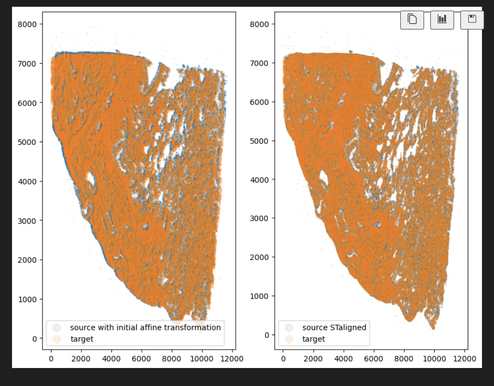

# STalign: Spatial Transcriptomics Alignment

STalign is a computational method for spatially aligning spatial transcriptomics (ST) datasets by leveraging Large Deformation Diffeomorphic Metric Mapping (LDDMM) and image varifolds. It enables alignment of both single-cell resolution and multi-cellular pixel-resolution ST data, supporting transformations in both 2D and 3D coordinate systems.

## Datasets Used

The following datasets were used for alignment using STalign:

### Experiment 1
- **Dataset:** Xenium In Situ Gene Expression (Xenium v1) data for adult human lung adenocarcinoma tissue (FFPE)
- **Panel:** Xenium Human Lung Gene Expression Panel with nuclear expansion

### Experiment 2
- **Dataset:** Xenium Prime 5K In Situ Gene Expression with Cell Segmentation data for human lung adenocarcinoma tissue (FFPE)
- **Panel:** Xenium Prime 5K Human Pan Tissue and Pathways Panel

These datasets are provided in the `data/` folder for internal use, but they are also publicly available as part of the *Post-Xenium In Situ Applications: Immunofluorescence, H&E, Visium v2, and Visium HD Technical Note* (CG000709, Rev C).

## Results

The alignment results are:

.
